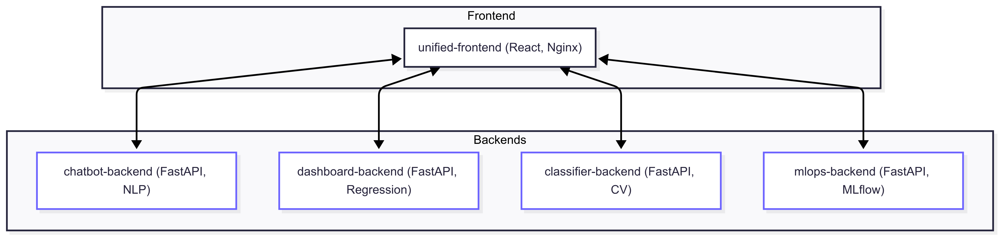
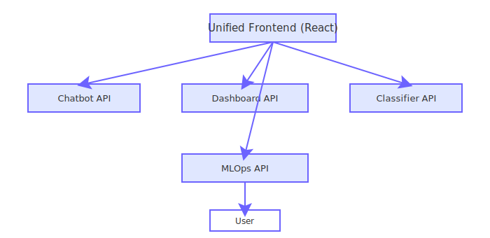
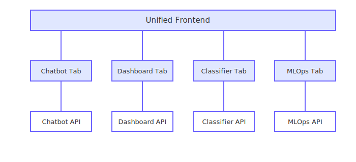
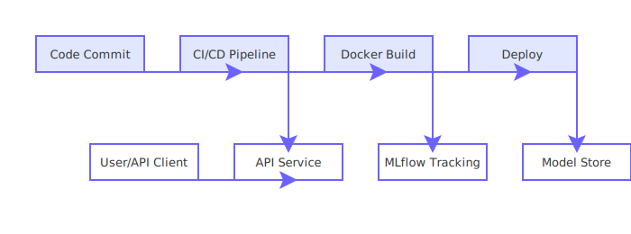

# AI Demos: Unified AI/ML Portfolio Platform

This project is a unified, production-ready platform showcasing multiple AI/ML demos. It demonstrates your ability to build, deploy, and integrate real-world machine learning solutions with modern frontend, robust APIs, and MLOps best practices.

## 🚀 What’s Included
- **Unified React Frontend**: Tabbed interface to access all demos in one place.
- **AI-Powered Chatbot**: NLP chatbot using Hugging Face Transformers.
- **Predictive Analytics Dashboard**: Real-time sales prediction with scikit-learn.
- **Medical Image Classifier**: Deep learning (ResNet18) for X-ray/MRI image classification.
- **End-to-End MLOps Pipeline**: Spam classifier with MLflow experiment tracking and retraining.
- **Docker Compose**: Orchestrates all services for local or production deployment.

## 🏗️ Architecture



- **Frontend**: `/unified-frontend` (React, Nginx in production)
- **Backends**:
  - `/chatbot/backend` (FastAPI, NLP)
  - `/predictive-dashboard/backend` (FastAPI, regression)
  - `/medical-image-classifier/backend` (FastAPI, computer vision)
  - `/mlops-pipeline/backend` (FastAPI, MLflow, retraining)
- **Orchestration**: `docker-compose.yml` for full-stack deployment

## 🔄 More Diagrams
- 
- 
- 

## 🧑‍💻 Usage
### Local Development
1. Start each backend (see their README for details)
2. Start the frontend:
   ```bash
   cd unified-frontend
   npm install
   npm start
   ```
3. Open [http://localhost:3000](http://localhost:3000)

### Docker Compose (Recommended)
```bash
  docker-compose up --build
```
- Visit [http://localhost:3000](http://localhost:3000) for the unified UI.

## 🧠 AI/ML Highlights
- **NLP**: Chatbot with Hugging Face Transformers (DialoGPT)
- **Regression**: Sales prediction with scikit-learn
- **Computer Vision**: ResNet18 for image classification
- **MLOps**: MLflow for experiment tracking, retraining, and model management

## 💡 Why This Project Stands Out
- **Full-stack AI/ML engineering**: End-to-end demos from data to UI
- **Production-ready**: Dockerized, documented, and modular
- **MLOps best practices**: Experiment tracking, retraining, and robust deployment
- **Modern UX**: Unified, recruiter-friendly interface

## 📁 See Each Folder for More Details
- [unified-frontend/README.md](./unified-frontend/README.md)
- [chatbot/backend/README.md](./chatbot/backend/README.md)
- [predictive-dashboard/backend/README.md](./predictive-dashboard/backend/README.md)
- [medical-image-classifier/backend/README.md](./medical-image-classifier/backend/README.md)
- [mlops-pipeline/backend/README.md](./mlops-pipeline/backend/README.md)
